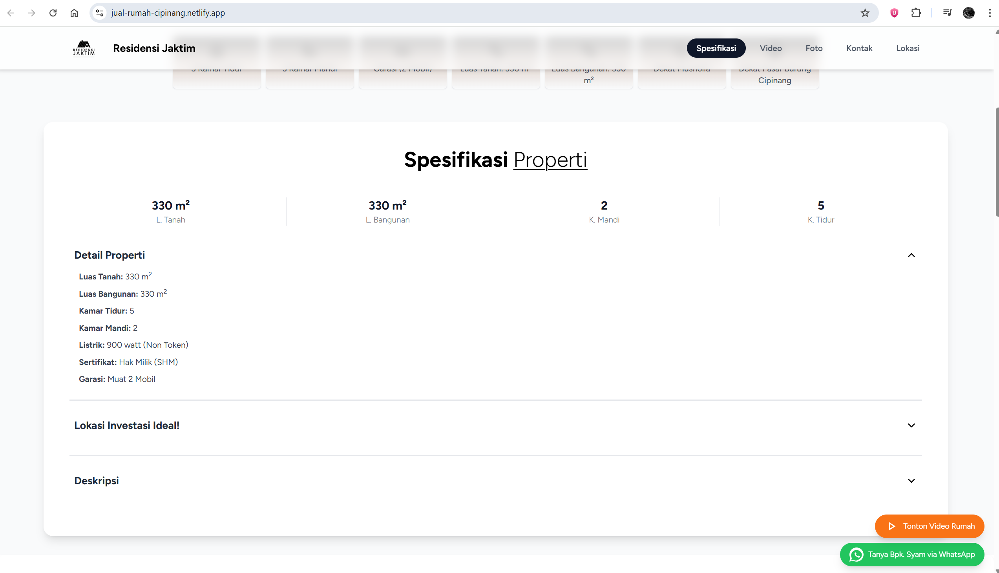
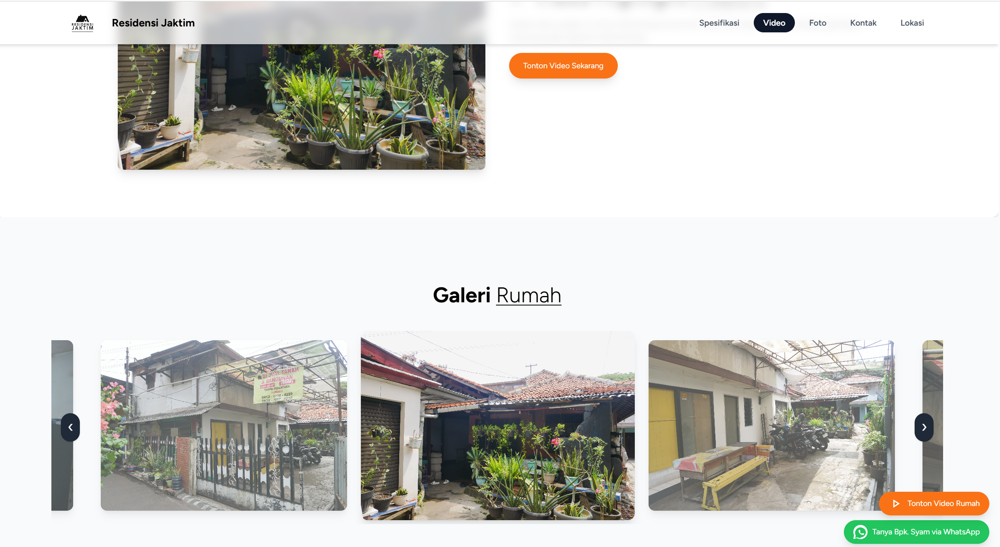
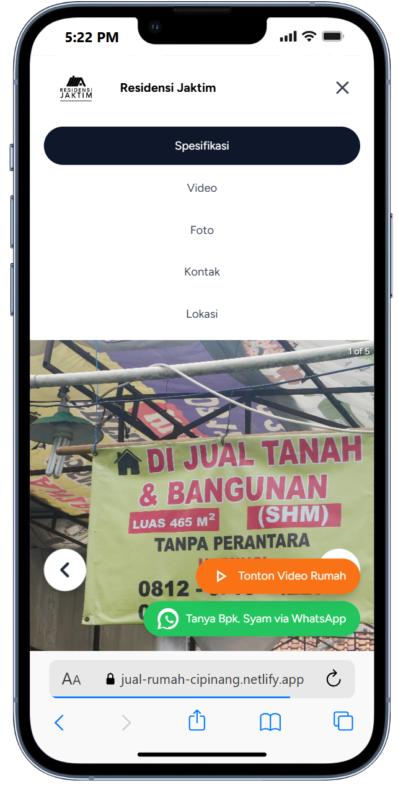

## 📖 Overview

**Live Preview** : **[https://jual-rumah.netlify.app/](https://jual-rumah-cipinang.netlify.app/)**

---

## 🛠 Tech Stack

- **React (Vite)** – Fast React development environment with instant Hot Module Reload (HMR).  
- **Tailwind CSS** – Utility-first CSS framework for elegant, responsive design using minimal custom styles.
- **Lucide React** – Lightweight, tree-shakable icon library with inline SVG components for minimal bundle size.  

---

## Screenshots

---

# React + Vite

This template provides a minimal setup to get React working in Vite with HMR and some ESLint rules.

Currently, two official plugins are available:

- [@vitejs/plugin-react](https://github.com/vitejs/vite-plugin-react/blob/main/packages/plugin-react/README.md) uses [Babel](https://babeljs.io/) for Fast Refresh
- [@vitejs/plugin-react-swc](https://github.com/vitejs/vite-plugin-react-swc) uses [SWC](https://swc.rs/) for Fast Refresh
